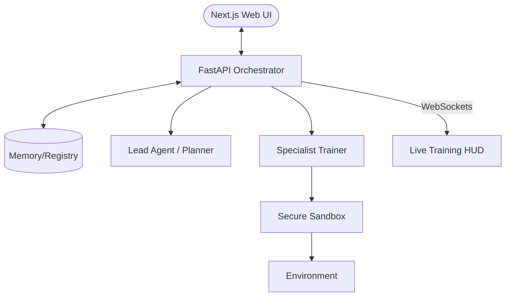

# astra: Design Document

**Architecture Version:** 1.0.0  
**Core Stack:** Python, PyTorch, SQLAlchemy (Registry), FastAPI (Backend API), Next.js 15 (Frontend Dashboard)

---

## 1. System Overview
astra is designed as a modular system where a **Lead Agent** orchestrates several **Specialist Agents**, served via a high-performance **FastAPI** backend and a **Next.js** professional dashboard.

## 2. Components

### 2.1. LLM-Driven Orchestrator (Lead Agent)
The "Brain" of astra. It uses a Large Language Model (e.g., Llama-3, Gemma-3) to:
- **Plan**: Decompose the training goal into a strategic DAG (Directed Acyclic Graph).
- **Pivot**: Analyze logs and metrics to decide if a training run should be aborted or modified.
- **Refine**: Propose new hyperparameters or reward weights for the next iteration.

### 2.2. Autonomous Training Loop
The execution engine that manages the state machine of training:
- **Phase Management**: Handles transitions between curriculum steps.
- **Retry Logic**: Automatically restarts failed runs with adjusted noise or exploration parameters.
- **Goal Tracking**: Continuous comparison between current performance and target metrics.

### 2.3. Multi-Tier Memory System
- **Structured Registry (SQL)**: Tracks every experiment's DNA—hyperparameters, weights, and results.
- **Vector Memory (Semantic)**: Stores "lessons learned" from previous training runs (e.g., "High learning rates in grid size 32x24 lead to divergence").
- **Working Memory**: Real-time buffer for current logs and telemetry being analyzed by the LLM.

### 2.4. Specialist Trainer (Execution)
The worker agents that interface with diverse training paradigms:
- **Universal Code Generator**: LLM-driven generation for:
  - **RL**: Gym/PettingZoo environments and policy gradients.
  - **SFT**: HuggingFace Transformers, LoRA/QLoRA configurations, and dataset formatting.
  - **ML**: Scikit-learn, PyTorch Lightning, and XGBoost/LightGBM.
- **Framework Wrappers**: Standardized interfaces for common libraries (Transformers, SB3, PyTorch).
- **Telemetry Producer**: Streams paradigm-specific metrics (e.g., Reward for RL, Perplexity for SFT, Accuracy/F1 for ML).

### 2.5. Secure Execution Sandbox
The isolation layer where training actually occurs:
- **Containerized Runtime**: Uses Docker or Podman to isolate the training environment.
- **Resource Guard**: Enforces memory and compute limits to ensure system stability.
- **Filesystem Isolation**: Restricts training code access to specific project directories and the Model Registry.

### 2.6. Specialist Evaluator (Validation)
Independent agent that ensures the training isn't just "overfitting" to the environment:
- **Benchmark Suite**: Runs the model against a "Golden Set" of challenges.
- **Stress Tester**: Introduces noise and edge cases to verify robustness.

### 2.7. Analysis & Introspection Suite
Deep-dive tools for "Explainable AI":
- **Spatial Analyzer**: For CNNs, generates saliency maps to see what the agent is "looking at."
- **Policy Auditor**: Visualizes the action distribution to detect mode collapse or bias.

## 3. Data Flow
1. **Initiation**: User sends goal.
2. **Recipe Retrieval**: Lead Agent queries the **Recipe Library** for similar past successes to create a "Warm-Start" plan.
3. **Planning**: Lead Agent refines the retrieved recipe or designs a new DAG from scratch.
4. **Implementation**: Specialist Trainer generates code based on the plan/recipe.
5. **Sandboxing & Execution**: Training runs in the secure environment.
6. **Promotion & Evaluation**: Standard progress tracking.
7. **Crystallization**: If the goal is met, the system distills the final, optimized strategy into a new **Recipe** and saves it to the Library.
8. **Finalization**: Registry update and report generation.

## 4. Security & Autonomy Gates

### 4.1. The Approval Controller
A centralized service that intercepts high-risk transitions in the DAG:
- **Gate: `EXECUTE_CODE`**: Pauses the loop and presents the generated script to the user for a "Safety Check."
- **Gate: `RESOURCE_ALLOCATION`**: Triggers if the planned iteration exceeds the remaining "Quota" (GPU hours or memory).
- **Gate: `DEPLOY_MODEL`**: Requires human sign-off before a champion model is moved from the Registry to a production endpoint.

### 4.2. Autonomy Tiers
Astra supports three operating modes:
1. **Guided**: Every iteration step requires an "Approve/Reject" signal.
2. **Supervised (Default)**: Astra iterates autonomously but pauses for `EXECUTE_CODE` and `RESOURCE_ALLOCATION`.
3. **Full Autonomy**: Astra runs to completion (target achieved) without intervention, governed only by strict Sandbox and Resource constraints.

### 4.3. Monitoring Dashboard (The "HUD")
A real-time interface showing:
- **Loop Status**: Current iteration count and strategic pivot history.
- **Metric Delta**: Visual gap between "Current Best" and "Target Goal."
- **Approval Queue**: Pending security requests with "Diff" views for code changes.
ration count and strategic pivot history.
- **Metric Delta**: Visual gap between "Current Best" and "Target Goal."
- **Approval Queue**: Pending security requests with "Diff" views for code changes.
