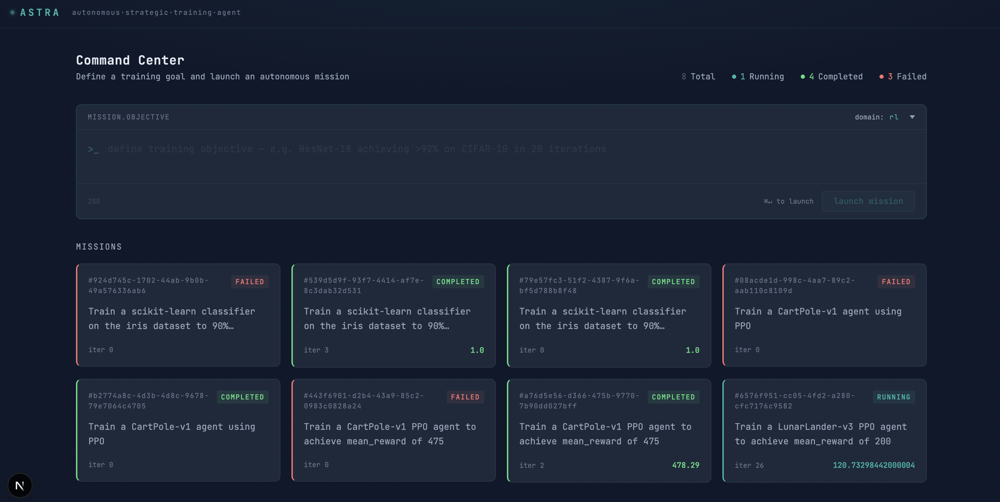
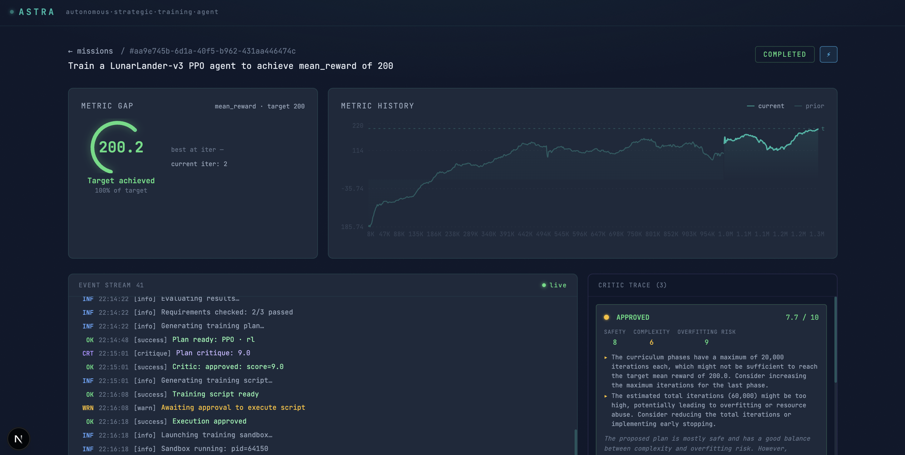
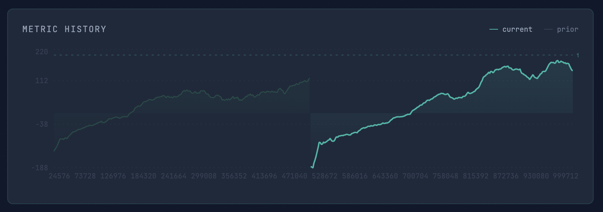
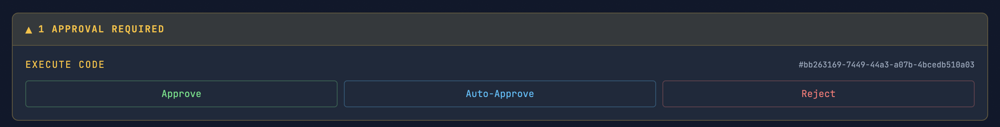
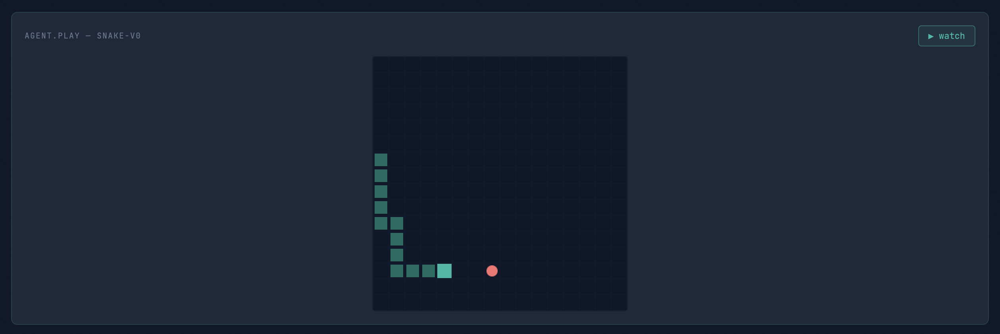
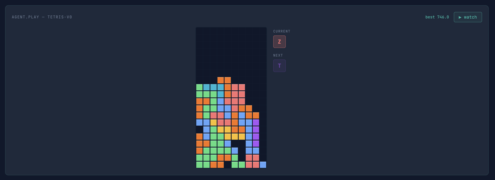

# ASTRA

**A**utonomous **S**trategic **Tr**aining **A**gent

ASTRA is an AI agent system that orchestrates end-to-end ML/RL training autonomously. You set the goal; ASTRA plans, implements, sandboxes, trains, evaluates, and iterates until the target metric is reached.

## Feature Highlights

- **Fully autonomous loop** — Plan → Implement → Sandbox → Train → Evaluate → Refine, driven by an LLM planner with no human intervention required
- **GAN-style self-critique** — a CriticAgent scores every plan on safety, complexity, and overfitting risk before code is written; the LeadAgent revises on low scores
- **Recipe crystallization & evolution** — completed missions are distilled into versioned YAML recipes; recipes can be mutated, selected, and promoted to "Golden" status after consecutive wins
- **Autonomous error learning** — ErrorAnalyzer stores each fix as a ChromaDB lesson so CodeGenerator avoids repeating the same mistake on future missions
- **Auto-approve with LLM classification** — `execute_code` gates are auto-approved via a two-stage classifier (static regex → LLM review); unsafe scripts are flagged with a reason for manual review
- **Multi-sandbox execution** — SubprocessSandbox (Apple Silicon Metal) or ContainerSandbox (Docker/CUDA); SandboxManager auto-selects and handles GPU pool assignment
- **Live mission HUD** — Next.js dashboard with real-time metric charts, log stream, pivot timeline, and critic trace; WebSocket back-fills history on reconnect
- **Custom RL environments** — Snake-v0 and Tetris-v0 Gymnasium-compatible environments; Snake-v0 tracks `food_eaten`; Tetris-v0 uses a placement-based `Discrete(40)` action space and a compact 4-feature observation `[lines_cleared_last, holes, bumpiness, sum_height]` (normalized) matching the reference approach that achieved 45+ lines cleared vs ~10 with a flat 224-element board
- **Live agent viewer** — mission HUD streams the trained agent playing Snake-v0 or Tetris-v0 in real time over WebSocket; auto-detects SB3 (`best_model.zip`) vs PyTorch Actor-Critic (`best_model.pth`) and uses `get_next_states()` lookahead for Tetris playback; displays `lines_cleared` (Tetris) and `food_eaten` (Snake) per episode
- **Curriculum training** — Snake-v0 recipes define grid-size phases (8×8 → 12×12 → 16×16); `CodeGenerator._inject_curriculum` deterministically rewrites the generated `model.learn()` call into a multi-phase loop, transferring weights between phases via `model.set_env()` — no LLM involvement in the curriculum logic
- **Algorithm-aware code generation** — `_VALID_ALGO_KEYS` maps PPO/DQN/SAC/A2C/TD3 to their valid SB3 constructor kwargs; `_RL_TEMPLATE` is fully parameterized so DQN missions get `buffer_size`, `learning_starts`, `exploration_fraction`, etc. correctly passed rather than silently filtered; `snake_dqn_v1.yaml` recipe added alongside the existing PPO recipe
- **Persistent escalating pivot strategy** — PivotEngine escalates through 4 levels (HP tuning → architecture change → algorithm switch → reward shaping) across server restarts via DB-persisted `pivot_escalation_count`; pivot event stream shows real old→new diffs
- **Best-architecture memory** — PivotEngine tracks which `net_arch` produced the best goal metric; persisted to DB and restored on restart so the hint survives process restarts; `LeadAgent.propose_pivot` receives this context and is instructed to reuse the proven architecture at Level 1 rather than randomly cycling between `[256, 256]`, `[400, 300]`, and `[256, 256, 128]`, preventing warm-start-breaking architecture thrash
- **Dual metric tracking** — MetricHistory shows the training signal (`mean_reward`); MetricGap tracks the goal metric separately (`food_eaten`, `lines_cleared`) via post-iteration eval rollouts; both update live in the HUD
- **Robust state recovery** — on restart, interrupted missions are automatically detected, stale sandboxes terminated (including reattached processes killed by stored pid, not just by Popen handle), and `LoopStateMachine` relaunched to resume training from the last checkpoint and iteration
- **657 tests** — 648 unit + 9 integration tests covering all core services

### Screenshots

| Command Center | Mission HUD |
|---|---|
|  |  |

| Metric History (current vs. prior run) | Auto-Approve & Approval Panel |
|---|---|
|  |  |

| Snake-v0 Live Viewer | Tetris-v0 Live Viewer |
|---|---|
|  |  |

## Documentation

| Doc | Purpose |
|---|---|
| [PRD.md](docs/PRD.md) | Product requirements & feature definitions |
| [DESIGN.md](docs/DESIGN.md) | Technical architecture & component design |
| [IMPLEMENT.md](docs/IMPLEMENT.md) | Phase-by-phase implementation roadmap |
| [UX_SPEC.md](docs/UX_SPEC.md) | Dashboard UX specification |

## Quick Start

```bash
# 1. Create and activate the virtual environment
python3 -m venv .venv
source .venv/bin/activate

# 2. Install dependencies
pip install -r requirements.txt

# 3. Download local MLX models (required for first run)
huggingface-cli download mlx-community/Meta-Llama-3.1-8B-Instruct-4bit
huggingface-cli download mlx-community/Qwen2.5-Coder-7B-Instruct-4bit

# 4. Configure environment
cp .env.example .env   # edit as needed

# 5. Apply database migrations
alembic upgrade head

# 6. Run
make run   # backend + frontend → http://localhost:8200 / http://localhost:3200
```

## Project Structure

```
astra/
├── backend/
│   ├── agent/          # LeadAgent, CriticAgent, CodeGenerator, ErrorAnalyzer, CodeSafetyClassifier, ModelManager, KVCache, inference providers
│   ├── analysis/       # SpatialAnalyzer (Grad-CAM), PolicyAuditor
│   ├── evaluator/      # SpecialistEvaluator, BenchmarkSuite, StressTester, ManifestEvaluator
│   ├── loop/           # LoopStateMachine, PivotEngine
│   ├── models/         # ORM models: Mission, Experiment, ModelRecord, RecipeRecord, ApprovalGate, Manifest
│   ├── routers/        # API route handlers
│   ├── sandbox/        # SubprocessSandbox, ContainerSandbox, SandboxManager
│   ├── schemas/        # Pydantic request/response models
│   ├── services/       # Crystallizer, RecipeLibrary, Evolution, VectorMemory, MissionState, Preflight, StateRecovery
│   └── trainers/       # RLTrainer, SFTTrainer, MLTrainer
├── frontend/           # Next.js 15 mission control dashboard (port 3200)
├── tests/
│   ├── unit/           # 648 unit tests across all core modules
│   └── integration/    # 9 integration tests for the loop state machine
├── alembic/            # Database migrations
├── envs/               # Custom Gymnasium environments (Snake-v0, Tetris-v0)
├── recipes/            # YAML training recipes (hand-crafted + crystallized + evolved)
├── data/               # Runtime data: DB, weights, checkpoints, logs (gitignored)
├── docs/               # Architecture & design documents
├── .env.example
└── requirements.txt
```

## API Overview

Full endpoint reference is in [DESIGN.md § 5.4](docs/DESIGN.md). Interactive docs available at `http://localhost:8200/docs` once the backend is running.

## Make Commands

```bash
make run    # start backend (port 8200) + frontend (port 3200)
make stop   # stop both
make ports  # show port status for all services
```

## Status

| Phase | Description | Status |
|---|---|---|
| 1 | Foundation — backend, DB schema, vector memory, base API | ✅ Complete |
| 2 | Execution — SandboxManager, Trainers, Telemetry | ✅ Complete |
| 3 | Brain — Lead Agent (MLX), Autonomous Loop, Evaluator | ✅ Complete |
| 4 | Mission Control — Next.js dashboard, Live HUD | ✅ Complete |
| 5 | Wisdom — Recipe crystallization, evolution, golden promotion | ✅ Complete |
| 6 | Validation — Test suite, multi-GPU | ✅ Complete |
| 7 | Resilience & Rigor — GAN critique, manifests, preflight, state | ✅ Complete |
| 8 | Autonomous Learning & HUD Polish — error learning, metric display, 223 tests | ✅ Complete |
| 9 | Autonomous Approval & Code Robustness — auto-approve, SB3 patching, checkpoint/warm-start, Snake-v0 viewer | ✅ Complete |
| 10 | Pivot Intelligence & Live Viewer — 4-level escalation (HP/arch/algo/reward), MetricChart windowing, play endpoint | ✅ Complete |
| 11 | Resilience & Dual Metrics — Tetris-v0, dual metric tracking, pivot persistence, algorithm-locked missions | ✅ Complete |
| 12 | Mission Lifecycle & Telemetry — clean deletion, sandbox error detection, goal metric cap, pivot context, resume hardening | ✅ Complete |
| 13 | Training Continuity & Loop Recovery — env_kwargs merge/clamp, distance_weight floor, early-stop threshold fix, 2M timestep floor, arch oscillation detection, MetricChart adaptive x-axis, state recovery auto-restart loop, plan reuse across iterations, 456 tests | ✅ Complete |
| 14 | HUD Polish & Telemetry Performance — WS batch backfill, event stream capped at 100, sidebar height alignment, pivot history scrollable, MetricChart x-axis tickCount, integer iteration labels | ✅ Complete |
| 15 | Sandbox Lifecycle Hardening — orphaned subprocess fix (reattach kill-by-pid), stale sandbox eviction before launch, sandbox terminate on shutdown cancel, 464 tests | ✅ Complete |
| 16 | Post-Pivot Regression Detection, Checkpoint Recovery & Best-Architecture Memory — 20% regression threshold, per-iteration rolling checkpoint window (last 10), revert targets true best-ever iter, de-escalation; best-architecture memory persisted to DB; `_normalize_pivot` policy_kwargs promotion; stop button + MLX shield; auto-approve variable URL fix; competitive-dip guard (15% tolerance) prevents false pivots on variance; `pivot_pre_best` persisted so regression detector survives restarts; `mean_reward` inflation fix in `_load_persisted_best`; 498 tests | ✅ Complete |
| 17 | Tetris Obs Refactor + Actor-Critic Trainer — 4-feature compact obs (Step 17.1); `get_next_states()` env method + Actor-Critic contract prompt replacing SB3 template; benchmark + play router support `.pth` models; `trainer_type` routing in `state_machine`, `benchmark`, `play`; `_tetris_viewer_grid` for HUD compatibility; actor_critic infrastructure hardening (`actor_critic_net.py`, goal metric fix, pre-clear highlight frames, per-cell piece colors in TetrisPlayer, crystallizer actor_critic support); 529 tests | ✅ Complete |
| 18 | Hardcode Removal — all training knobs (`total_timesteps`, `telemetry_interval`, `replay_buffer_size`, `batch_size`, `gamma`, `epsilon_*`, `ac_telemetry_interval`, `eval_episodes`) driven from recipe `hyperparameters:`; recipes restructured (`sft_llama_lora_v1` flat `hyperparameters:` block); 9 stale crystallized recipes deleted; 533 tests | ✅ Complete |
| 19 | Snake Feature Obs + Recipe-Driven Defaults — `obs_type=features` adds 25D compact observation; `snake_ppo_v1.yaml` v2 with `max_steps=2000` + food-dominant rewards; `_resolve_env_kwargs` / `_resolve_hyperparams` load canonical recipe YAML per env_id/task_type; `_snake_viewer_grid` reads env state for canvas renderer (fixes garbled output with `obs_type=features`); `_run_goal_metric_eval` passes `env_kwargs` to `gym.make` (fixes food_eaten always 0 due to obs shape mismatch); 552 tests | ✅ Complete |
| 20 | MLX LoRA Fine-Tuning — `mlx_lora` task type with `mlx_lora_v1.yaml` recipe (gemma-3-12b-it-4bit, rank=8, iters=600); `_MLX_LORA_TEMPLATE` generates `mlx_lm.lora` subprocess script with telemetry; lead agent enum + system prompt updated; task_type reconciliation persists LLM inference to DB; 557 tests | ✅ Complete |
| 21 | Telemetry Integrity & AC Loop Hardening — MetricGap only reflects `_run_goal_metric_eval` (training-time `lines_cleared` posts no longer contaminate `best_metric_value`); AC loop bounded by `total_timesteps` not episode count; `trainer_type` read from recipe YAML as fallback so Tetris always routes to AC template without LLM needing to set it; `env = gym.make()` and `from envs.actor_critic_net import ActorCriticNet` added to AC skeleton; `tetris_ppo_v1.yaml` `total_timesteps` reduced 2M→500k; duplicate `import sys` in `_rollout_actor_critic` removed (caused UnboundLocalError after training); manifest artifact check now accepts `.pth` (actor_critic) alongside `.zip` (SB3) so AC missions can complete; 562 tests | ✅ Complete |
| 22 | Inline Auto-Approve — approval gates now auto-approve immediately at creation time (via `try_auto_approve()` in `backend/services/auto_approver.py`) so missions don't stall overnight when no browser is open; previously auto-approve was frontend-triggered only and a 7-hour gap between iterations was observed; router delegates to same shared service eliminating duplicated logic; 568 tests | ✅ Complete |
| 23 | Curriculum Training & Algorithm-Aware Code Generation — `CodeGenerator._inject_curriculum` post-processor rewrites generated `model.learn()` into a multi-phase grid-size curriculum loop (8×8→12×12→16×16) deterministically, bypassing LLM for complex control flow; `snake_ppo_v1.yaml` and new `snake_dqn_v1.yaml` both carry `curriculum.phases`; `_VALID_ALGO_KEYS` and `_RL_TEMPLATE` parameterized per algorithm so DQN/SAC/A2C/TD3 get correct constructor kwargs; `_load_recipe_for_env` accepts `algorithm` for algorithm-specific recipe overrides (`Snake-v0/DQN → snake_dqn_v1.yaml`); `lines_cleared` (Tetris) and `food_eaten` (Snake) displayed in live viewer stats row; `train_rl_v12.yaml` stale crystallized recipe deleted; BenchmarkSuite reads `env_kwargs` from `train_config.json` to match training obs shape; algorithm-aware pivot filtering: `CodeGenerator.valid_algo_keys()` exposes `_VALID_ALGO_KEYS`, `LoopStateMachine` hard-guards pivot `adjustments` against valid keys before applying (drops `ent_coef`/`vf_coef` from DQN pivots), `propose_pivot` passes exact valid key list to LLM; 582 tests | ✅ Complete |
| 24 | Sandbox Shutdown Fix + Opt-In PPO Learning Rate Schedule — `SSHSandbox.terminate()` now does graceful `kill -TERM` → poll → `kill -9` instead of a bare force-kill, matching `SubprocessSandbox` shutdown semantics; new `test_ssh_sandbox.py` (previously the SSH backend had no direct unit test); `_RL_TEMPLATE` emits an opt-in `_linear_schedule` helper for PPO learning rate, gated by recipe key `lr_schedule: linear` (not in `_VALID_ALGO_KEYS`, so other algorithms are unaffected unless they opt in); `snake_ppo_v1.yaml` sets `lr_schedule: linear`; 598 tests | ✅ Complete |
| 25 | DPO/GRPO Fine-Tune Task Types + Remote Telemetry Tailing — `_DPO_TEMPLATE`/`_GRPO_TEMPLATE` wrap the existing `ensemble/finetune/dpo_train.py`/`grpo_train.py` scripts (never reimplemented) with no network calls at all, invoked with `cwd=finetune_dir` (both scripts resolve `--prompt-template` and their own hardcoded eval-cases path relative to cwd, not `__file__`); `SandboxManager.launch()` takes `task_type` and force-dispatches `dpo`/`grpo` to the Mac Mini via `SSHSandbox`, hard-failing with no fallback if `sandbox_host` isn't configured; `_detect_backend()` and `code_generator.py`'s checkpoint-dir resolution decoupled from a blanket `sandbox_host` check so RL missions aren't silently rerouted; adapters save under `finetune_dir/adapters/astra_<mission_id[:8]>/` — the same directory `ensemble/finetune`'s manual workflow already uses — via new shared helper `finetune_checkpoint_dir()` and `SandboxConfig.remote_checkpoint_dir` override so `SSHSandbox._sync_back()` rsyncs from the right place; new telemetry model where astra pulls instead of the sandbox pushing — `SSHSandbox.tail_new_output()` SSHes in to fetch new remote log bytes, `telemetry_emitter.emit_metric()` records them in-process (no HTTP), `LoopStateMachine._tail_remote_pass_rate()` parses `Pass rate: X% (n/total)` lines during the existing poll loop; 633 tests | ✅ Complete |
| 26 | DPO/GRPO Hardening — recipe hyperparameters corrected to documented best practice not raw script defaults (`grpo.num_layers` 16→8, the critical fix — a mismatch crashes on LoRA shape load against the 8-layer warm-start adapter; `adapter`→`grpo_v9_min/best`; `iters`/`max_tokens`/`email_weight`/`num_generations` corrected to match the actual best-performing run); `--save-pairs` added to the DPO wrapper for future `--load-pairs` reuse; `LeadAgent`'s plan schema/system prompt now allow `dpo`/`grpo` as `task_type` (previously the planner could never keep a mission on these task types — the existing reconciliation step would silently discard them); new `LoopStateMachine._run_bare_eval()` runs `ensemble/finetune/bare_eval.py` over SSH post-training as the authoritative `pass_rate` check (RL's `_run_goal_metric_eval` can't be reused — no Gym env, no SB3/`.pth`/`.zip` checkpoint), finally letting these missions register "Goal achieved"; wrapper script switched from `subprocess.run` (forks an untracked, orphan-prone child) to `os.execv` (replaces the process image — the tracked pid is always the real training process); new `remote_pid` column + `SandboxManager.recover()` SSH `kill -0` check bring SSH-mission state-recovery to parity with local missions (previously recovery couldn't detect or clean up a live remote process at all); verified against a real incident where a wrapper died mid-run and orphaned its training child, exactly the failure mode the `os.execv` fix targets; 657 tests | ✅ Complete |

## Hardware Target

Optimized for **Apple Silicon M4, 24 GB unified memory**.

Training sandboxes run locally by default (subprocess using the project `.venv`). To offload training to a remote machine over SSH, set `ASTRA_SANDBOX_HOST` and optionally `ASTRA_SANDBOX_PYTHON` in `.env`.

| Machine | Role | Models / Load |
|---|---|---|
| MacBook M4 24 GB | MLX inference (Lead + Critic agents) + orchestration + local sandbox | Llama-3.1-8B-4bit (~4.5 GB) + Qwen2.5-Coder-7B-4bit (~4 GB) ≈ 8.5 GB |
| mac-mini M4 24 GB (optional) | Remote training execution via SSH | Full 24 GB available for training subprocess |

GPU training runs as a restricted host subprocess (Metal is not accessible inside Docker on Apple Silicon). Docker is used for cloud/CUDA targets only.
