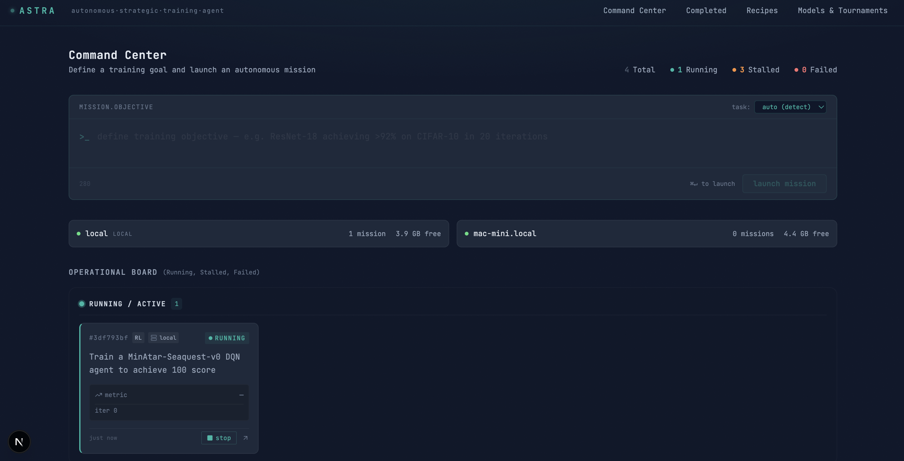
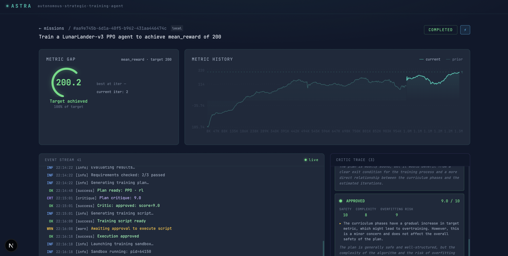
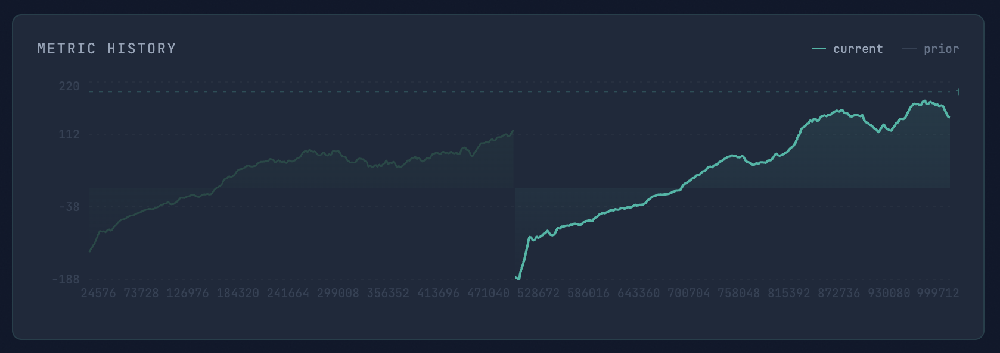
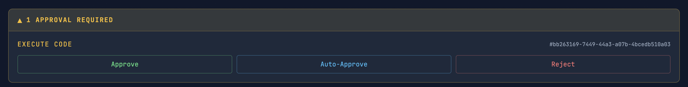
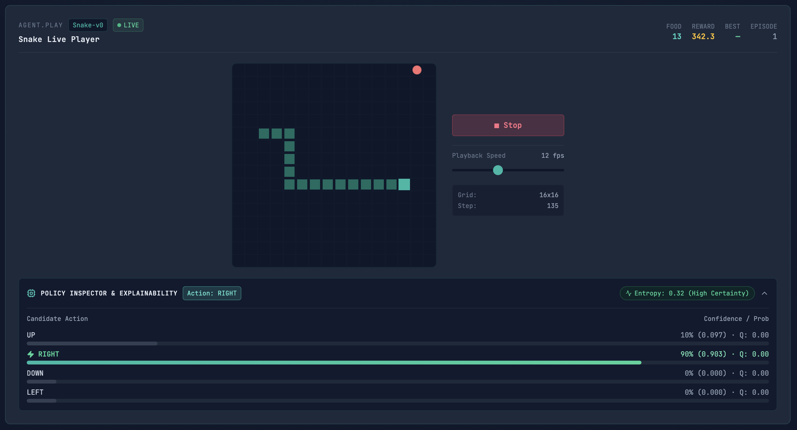
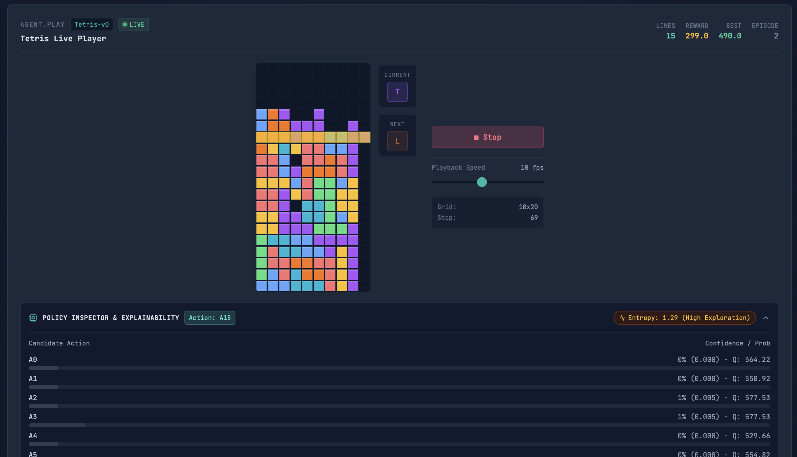

# ASTRA

**A**utonomous **S**trategic **Tr**aining **A**gent

ASTRA is an AI agent system that orchestrates end-to-end ML/RL training autonomously. You set the goal; ASTRA plans, implements, sandboxes, trains, evaluates, and iterates until the target metric is reached.

## Feature Highlights

- **Fully autonomous loop** — Plan → Implement → Sandbox → Train → Evaluate → Refine, with no human intervention required
- **GAN-style self-critique** — every plan is scored on safety, complexity, and overfitting risk before code is written, and revised on a low score
- **Recipe crystallization & evolution** — completed missions are distilled into versioned recipes that can be mutated, selected, and promoted to "Golden" status after consecutive wins
- **Autonomous error learning** — each fix is stored as a lesson so future missions avoid repeating the same mistake
- **Auto-approve with LLM classification** — code execution is auto-approved via a two-stage classifier; unsafe scripts are flagged with a reason for manual review
- **Multi-sandbox execution** — runs on Apple Silicon (Metal) or in Docker/CUDA containers, with automatic GPU pool assignment
- **Live mission HUD** — real-time metric charts, log stream, pivot timeline, and critic trace, with history back-filled on reconnect
- **Custom RL environments** — Snake-v0 and Tetris-v0, with observations rich enough (board features plus piece identity for Tetris) that standard RL algorithms — not just a custom lookahead trainer — can learn real placements
- **Live agent viewer** — watch the trained agent play Snake-v0 or Tetris-v0 in real time, for any supported trainer type
- **Curriculum training** — Snake-v0 missions can progress through increasing grid sizes within a single run, transferring learned weights between phases
- **Algorithm-aware code generation** — PPO, DQN, SAC, A2C, and TD3 each get their own correct set of hyperparameters, rather than being silently filtered down to a generic subset
- **Persistent escalating pivot strategy** — stuck missions escalate through hyperparameter tuning → architecture change → algorithm switch → reward shaping, with escalation state surviving server restarts
- **Best-architecture memory** — the system remembers which network architecture produced the best result for a mission and prefers reusing it over randomly cycling through others
- **Resilient warm-start across architecture pivots** — training resumes from whatever learned weights are still compatible with a new architecture, rather than a single change discarding all prior learning
- **Dual metric tracking** — the training signal (e.g. reward) and the actual goal metric (e.g. food eaten, lines cleared) are tracked separately, so the two can be compared and diverging trends are visible
- **Robust state recovery** — an interrupted mission's still-alive training run is reattached and resumed on restart, rather than killed; only a genuinely gone run gets reset and relaunched from the last checkpoint

### Screenshots

| Command Center | Mission HUD |
|---|---|
|  |  |

| Metric History (current vs. prior run) | Auto-Approve & Approval Panel |
|---|---|
|  |  |

| Snake-v0 Live Viewer | Tetris-v0 Live Viewer |
|---|---|
|  |  |

## Documentation

| Doc | Purpose |
|---|---|
| [PRD.md](docs/PRD.md) | Product requirements & feature definitions |
| [DESIGN.md](docs/DESIGN.md) | Technical architecture & component design |
| [IMPLEMENT.md](docs/IMPLEMENT.md) | Phase-by-phase implementation roadmap |
| [UX_SPEC.md](docs/UX_SPEC.md) | Dashboard UX specification |

## Quick Start

```bash
# 1. Create and activate the virtual environment
python3 -m venv .venv
source .venv/bin/activate

# 2. Install dependencies
pip install -r requirements.txt

# 3. Download local MLX models (required for first run)
huggingface-cli download mlx-community/Meta-Llama-3.1-8B-Instruct-4bit
huggingface-cli download mlx-community/Qwen2.5-Coder-7B-Instruct-4bit

# 4. Configure environment
cp .env.example .env   # edit as needed

# 5. Apply database migrations
alembic upgrade head

# 6. Run
make run   # backend + frontend → http://localhost:8200 / http://localhost:3200
```

## Project Structure

```
astra/
├── backend/
│   ├── agent/          # LeadAgent, CriticAgent, CodeGenerator, ErrorAnalyzer, CodeSafetyClassifier, ModelManager, KVCache, inference providers
│   ├── analysis/       # SpatialAnalyzer (Grad-CAM), PolicyAuditor
│   ├── evaluator/      # SpecialistEvaluator, BenchmarkSuite, StressTester, ManifestEvaluator
│   ├── loop/           # LoopStateMachine, PivotEngine
│   ├── models/         # ORM models: Mission, Experiment, ModelRecord, RecipeRecord, ApprovalGate, Manifest
│   ├── routers/        # API route handlers
│   ├── sandbox/        # SubprocessSandbox, ContainerSandbox, SSHSandbox, SandboxManager
│   ├── schemas/        # Pydantic request/response models
│   ├── services/       # Crystallizer, RecipeLibrary, Evolution, VectorMemory, MissionState, Preflight, StateRecovery
│   └── trainers/       # RLTrainer, SFTTrainer, MLTrainer
├── frontend/           # Next.js 15 mission control dashboard (port 3200)
├── tests/
│   ├── unit/           # 821 unit tests across all core modules
│   └── integration/    # 15 integration tests for the loop state machine
├── alembic/            # Database migrations
├── envs/               # Custom Gymnasium environments (Snake-v0, Tetris-v0)
├── recipes/            # YAML training recipes (hand-crafted + crystallized + evolved)
├── data/               # Runtime data: DB, weights, checkpoints, logs (gitignored)
├── docs/               # Architecture & design documents
├── .env.example
└── requirements.txt
```

## API Overview

Full endpoint reference is in [DESIGN.md § 5.4](docs/DESIGN.md). Interactive docs available at `http://localhost:8200/docs` once the backend is running.

## Make Commands

```bash
make run    # start backend (port 8200) + frontend (port 3200)
make stop   # stop both
make ports  # show port status for all services
```

## Status

| Phase | Description | Status |
|---|---|---|
| 1 | Foundation — backend, DB schema, vector memory, base API | ✅ Complete |
| 2 | Execution — SandboxManager, Trainers, Telemetry | ✅ Complete |
| 3 | Brain — Lead Agent (MLX), Autonomous Loop, Evaluator | ✅ Complete |
| 4 | Mission Control — Next.js dashboard, Live HUD | ✅ Complete |
| 5 | Wisdom — Recipe crystallization, evolution, golden promotion | ✅ Complete |
| 6 | Validation — Test suite, multi-GPU | ✅ Complete |
| 7 | Resilience & Rigor — GAN critique, manifests, preflight, state | ✅ Complete |
| 8 | Autonomous Learning & HUD Polish — error learning, metric display | ✅ Complete |
| 9 | Autonomous Approval & Code Robustness — auto-approve, SB3 patching, Snake-v0 viewer | ✅ Complete |
| 10 | Pivot Intelligence & Live Viewer — 4-level escalation, MetricChart windowing, play endpoint | ✅ Complete |
| 11 | Resilience & Dual Metrics — Tetris-v0, dual metric tracking, algorithm-locked missions | ✅ Complete |
| 12 | Mission Lifecycle & Telemetry — clean deletion, sandbox error detection, resume hardening | ✅ Complete |
| 13 | Training Continuity & Loop Recovery — env_kwargs clamp, arch oscillation detection, auto-restart loop | ✅ Complete |
| 14 | HUD Polish & Telemetry Performance — WS batch backfill, capped event stream, adaptive charts | ✅ Complete |
| 15 | Sandbox Lifecycle Hardening — orphaned subprocess fix, stale sandbox eviction | ✅ Complete |
| 16 | Post-Pivot Regression Detection & Best-Architecture Memory — checkpoint recovery, de-escalation | ✅ Complete |
| 17 | Tetris Obs Refactor + Actor-Critic Trainer — compact obs, `.pth` model support end-to-end | ✅ Complete |
| 18 | Hardcode Removal — all training knobs driven from recipe `hyperparameters:` | ✅ Complete |
| 19 | Snake Feature Obs + Recipe-Driven Defaults — 25D compact observation, canonical recipe loading | ✅ Complete |
| 20 | MLX LoRA Fine-Tuning — `mlx_lora` task type, `mlx_lm.lora` subprocess wrapper | ✅ Complete |
| 21 | Telemetry Integrity & AC Loop Hardening — goal-metric isolation, Actor-Critic completion fixes | ✅ Complete |
| 22 | Inline Auto-Approve — gates auto-approve at creation, no more overnight stalls | ✅ Complete |
| 23 | Curriculum Training & Algorithm-Aware Code Generation — multi-phase grid curriculum, per-algorithm pivots | ✅ Complete |
| 24 | Sandbox Shutdown Fix + Opt-In PPO Learning Rate Schedule — graceful SSH terminate, `lr_schedule: linear` | ✅ Complete |
| 25 | DPO/GRPO Fine-Tune Task Types + Remote Telemetry Tailing — wraps `ensemble/finetune` scripts, SSH-tailed telemetry | ✅ Complete |
| 26 | DPO/GRPO Hardening & Recipe Lockout — recipe correctness fixes, `bare_eval` goal check, orphan-proof `os.execv` dispatch, recovery parity, `loss` training signal, collection-progress status, auto-approve for known-safe dispatch, pivots can no longer override recipe hyperparameters | ✅ Complete |
| 27 | Sandbox Reattach, Guided Autonomy Mode, and Pivot-Failure Resilience — resume a still-alive sandbox in place instead of killing it, guided mode actually implemented, a malformed LLM pivot response no longer crashes the mission, pivot hyperparameter/architecture clamp hardening | ✅ Complete |
| 28 | Backend Crash Resilience: Metal/GPU Failures — four separate uncatchable Metal aborts root-caused and fixed (real-memory-aware GC, a process-wide Metal lock), one confirmed unfixable upstream in `mlx` itself | ✅ Complete |
| 29 | Recipe, Crystallizer & Tetris-v0 Algorithm Correctness — every crystallized recipe had the wrong domain field, Tetris-v0 missions silently ignored the requested algorithm, missing piece-identity observation feature | ✅ Complete |
| 30 | os.execv Dpo/Grpo Static Auto-Approve Rule Actually Implemented — a documented-but-never-written check finally added, after it stalled a live mission for 26+ minutes | ✅ Complete |
| 31 | Lookahead-Augmented DQN/PPO/A2C for Tetris-v0 — custom trainers giving each algorithm the same `get_next_states()` search capability as the Actor-Critic trainer, without losing its own algorithmic identity | ✅ Complete |
| 32 | Snake-v0 Flood-Fill Reachable-Space Feature — real BFS reachable-space scoring after each candidate move, closing the same class of observation gap that limited Tetris | ✅ Complete |
| 33 | Pivot Engine: Competitive-Dip Suppression Guard Expiry — a metric orbiting just under its peak could suppress every pivot check indefinitely; now capped so a real plateau always eventually escalates | ✅ Complete |

## Hardware Target

Optimized for **Apple Silicon M4, 24 GB unified memory**.

Training sandboxes run locally by default (subprocess using the project `.venv`). To offload training to a remote machine over SSH, set `ASTRA_SANDBOX_HOST` and optionally `ASTRA_SANDBOX_PYTHON` in `.env`.

| Machine | Role | Models / Load |
|---|---|---|
| MacBook M4 24 GB | MLX inference (Lead + Critic agents) + orchestration + local sandbox | Llama-3.1-8B-4bit (~4.5 GB) + Qwen2.5-Coder-7B-4bit (~4 GB) ≈ 8.5 GB |
| mac-mini M4 24 GB (optional) | Remote training execution via SSH | Full 24 GB available for training subprocess |

GPU training runs as a restricted host subprocess (Metal is not accessible inside Docker on Apple Silicon). Docker is used for cloud/CUDA targets only.
