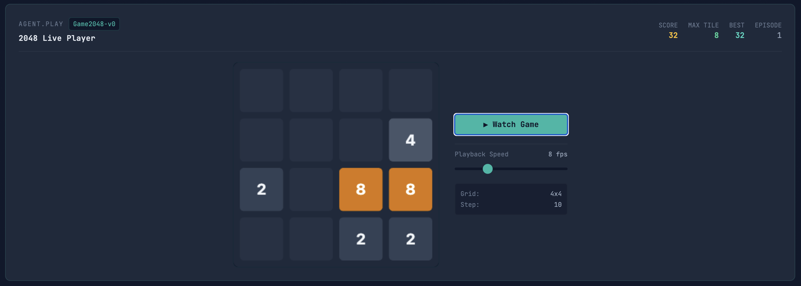
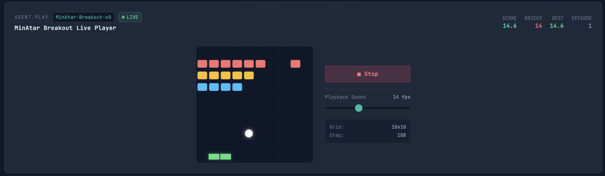
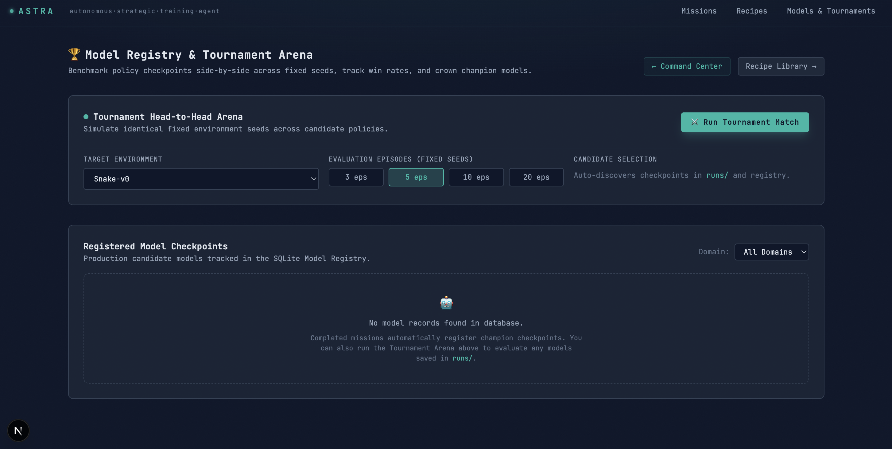
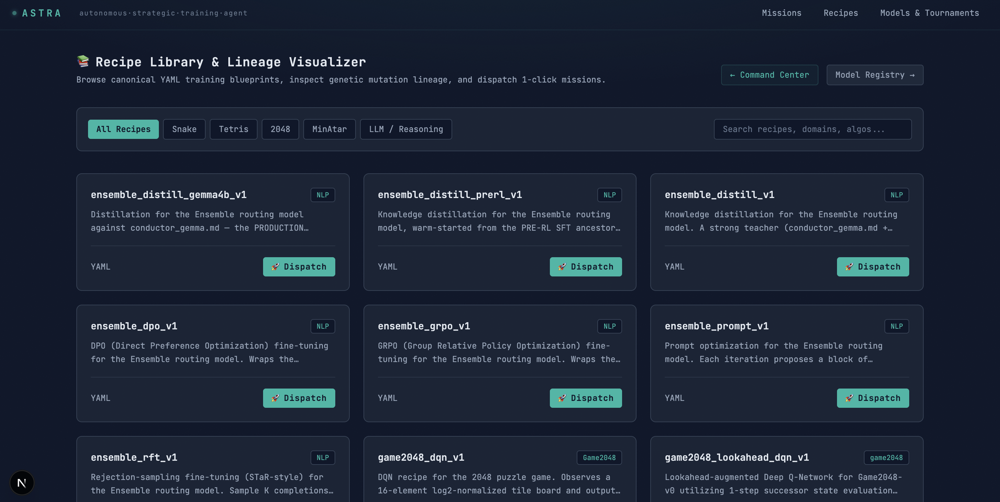

# ASTRA

**A**utonomous **S**trategic **Tr**aining **A**gent

ASTRA is an AI agent system that orchestrates end-to-end ML/RL training autonomously. You set the goal; ASTRA plans, implements, sandboxes, trains, evaluates, and iterates until the target metric is reached.

## Feature Highlights

- **End-to-End Autonomous Loop** — Plan → Critique → Implement → Sandbox → Train → Evaluate → Refine. Integrates GAN-style plan critique, automatic error recovery, and convergence guards that prevent runaway compute.
- **Adaptive Escalating Pivots** — Stalled missions systematically escalate across hyperparameter tuning, network architecture mutations, algorithm switches, and environment reward shaping, with progress persisted across restarts. Goals that name a trainer stay on it; unnamed "RL agent" goals seed the env recipe algorithm and, once plateaued, switch to a *different* trainer (`SB3 PPO` → `PPO` is not a switch).
- **Model Registry & Tournament Arena** — Benchmark multiple models head-to-head on identical deterministic seeds (`2000 + ep`), tracking score distributions and tie-split win rates to automatically crown champion policies.
- **Recipe Library & Lineage Evolution** — Reusable YAML training blueprints with genetic mutation tracking (Lineage DAG), "Golden" recipe distillation from successful runs, and unified mission creation & dispatch with automatic canonical goal formatting (`Train a <env_id> <algo> agent to achieve <target_value> <metric_name>`).
- **Dedicated Completed Missions Archive & Proof Verification** — Dedicated historical repository (`/completed`) with multi-domain category tabs, instant search, sortable metrics, and verifiable requirement manifests (`score >= target: PASSED`, `clean sandbox exit: PASSED`).
- **Live Mission HUD & Model Play** — Missions stay on training (telemetry, memory gauges, pivots). Play / inference is `/models/{id}`: canvas players stream frame-by-frame Q-values, action probabilities, and Shannon policy entropy.
- **High-Throughput Custom Envs** — Pure Python/NumPy environments (>50k steps/sec) for Snake, Tetris, 2048 (with 1-step lookahead evaluation), the MinAtar arcade suite (Breakout, Space Invaders, Asteroids, Asterix, Freeway, Seaquest), Grid Pac-Man, and MultiTurnAgentGym.
- **Multi-Paradigm Post-Training & Hybrid Compute** — Supports RL, SFT (with strict held-out validation and reasoning `<think>...</think>` preservation), DPO, GRPO, Distillation, and ML across local Apple Silicon (Metal/MLX) and remote SSH compute nodes with real-time cluster memory visibility.


### Screenshots

| Command Center | Mission HUD |
|---|---|
|  |  |

| Metric History (current vs. prior run) | Auto-Approve & Approval Panel |
|---|---|
|  |  |

| Snake-v0 Live Viewer | Tetris-v0 Live Viewer |
|---|---|
|  |  |

| Game2048-v0 Live Viewer | MinAtar-Breakout-v0 Live Viewer |
|---|---|
|  |  |

| Model Registry & Tournament Leaderboard | Recipe Library & Lineage Visualizer |
|---|---|
|  |  |


## Documentation

| Doc | Purpose |
|---|---|
| [PRD.md](docs/PRD.md) | Product requirements & feature definitions |
| [DESIGN.md](docs/DESIGN.md) | Technical architecture & component design |
| [IMPLEMENT.md](docs/IMPLEMENT.md) | Phase-by-phase implementation roadmap |
| [UX_SPEC.md](docs/UX_SPEC.md) | Dashboard UX specification |

## Task Types

ASTRA supports ten training paradigms — `rl`, `sft`, `ml`, `mlx_lora`, `dpo`, `grpo`, `distill`, `rft`, `prompt`, `star` — each driving a different trainer/code-gen path. See [DESIGN.md § 2.4](docs/DESIGN.md) for what each one optimizes and how it trains.

## Quick Start

```bash
# 1. Create and activate the virtual environment
python3 -m venv .venv
source .venv/bin/activate

# 2. Install dependencies
pip install -r requirements.txt

# 3. Download local MLX models (required for first run)
huggingface-cli download mlx-community/Meta-Llama-3.1-8B-Instruct-4bit
huggingface-cli download mlx-community/Qwen2.5-Coder-7B-Instruct-4bit

# 4. Configure environment
cp .env.example .env   # edit as needed

# 5. Apply database migrations
alembic upgrade head

# 6. Run
make run   # backend + frontend → http://localhost:8200 / http://localhost:3200
```

## Project Structure

```
astra/
├── backend/
│   ├── agent/          # LeadAgent, CriticAgent, CodeGenerator, ErrorAnalyzer, CodeSafetyClassifier, ModelManager, KVCache, inference providers
│   ├── analysis/       # SpatialAnalyzer (Grad-CAM), PolicyAuditor
│   ├── evaluator/      # SpecialistEvaluator, BenchmarkSuite, StressTester, ManifestEvaluator
│   ├── loop/           # LoopStateMachine, PivotEngine
│   ├── models/         # ORM models: Mission, Experiment, ModelRecord, RecipeRecord, ApprovalGate, Manifest
│   ├── routers/        # API route handlers
│   ├── sandbox/        # SubprocessSandbox, ContainerSandbox, SSHSandbox, SandboxManager
│   ├── schemas/        # Pydantic request/response models
│   ├── services/       # Crystallizer, RecipeLibrary, Evolution, VectorMemory, MissionState, Preflight, StateRecovery
│   └── trainers/       # RLTrainer, SFTTrainer, MLTrainer
├── frontend/           # Next.js 15 mission control dashboard (port 3200)
├── tests/
│   ├── unit/           # 1204 unit tests across all core modules
│   └── integration/    # 20 integration tests for the loop state machine and stress test suites
├── alembic/            # Database migrations
├── envs/               # Custom Gymnasium environments (Snake, Tetris, 2048, MinAtar suite, Grid Pac-Man, AgentGym)
├── recipes/            # YAML training recipes (hand-crafted + crystallized + evolved)
├── data/               # Runtime data: DB, weights, checkpoints, logs (gitignored)
├── docs/               # Architecture & design documents
├── .env.example
└── requirements.txt
```

## API Overview

Full endpoint reference is in [DESIGN.md § 5.4](docs/DESIGN.md). Interactive docs available at `http://localhost:8200/docs` once the backend is running.

## Make Commands

```bash
make run    # start backend (port 8200) + frontend (port 3200)
make stop   # stop both
make ports  # show port status for all services
```

## Strategic Development Milestones

ASTRA's architecture and capabilities are structured into seven core development epochs:

| Epoch | Scope & Strategic Capabilities | Key Components | Status |
|---|---|---|---|
| **Epoch 1: Autonomous Execution Engine** (Phases 1–16, 85) | Autonomous Plan-Critique-Implement-Train-Eval loop, GAN-style plan critique, self-healing code generation, 4-stage escalating pivots, regression rollback, and vector memory. | `LoopStateMachine`, `LeadAgent`, `CriticAgent`, `CodeGenerator`, `PivotEngine`, `VectorMemory` | ✅ Complete |
| **Epoch 2: Reinforcement Learning & Lookahead** (Phases 17–24, 31–32) | High-throughput pure Gymnasium environments (Snake-v0, Tetris-v0), 1-step successor lookahead DQN/PPO/A2C, flood-fill reachable space features, and curriculum learning. | `SnakeEnv`, `TetrisEnv`, lookahead DQN, custom reward shaping | ✅ Complete |
| **Epoch 3: Post-Training, Distillation & Compute Cluster** (Phases 25–30, 33–50) | Remote SSH compute sandboxes, DPO, GRPO, Distillation, RFT, and Prompt optimization; cluster visibility (Nodes panel), checkpoint chaining, and convergence guards. | `SSHSandbox`, `SandboxManager`, DPO/GRPO/Distill trainers, Nodes panel, Kanban board | ✅ Complete |
| **Epoch 4: Arcade Simulation Suite & Live HUD Explainability** (Phases 51–54, 65, 79, 81–84) | MinAtar suite (Breakout, Space Invaders, Asteroids, Asterix, Freeway, Seaquest), Grid Pac-Man, Game2048-v0; play / inference on `/models/{id}` with live Q-values, action distributions, and Shannon entropy. | MinAtar suite, `GridPacManEnv`, `Game2048Env`, `MinAtarPlayer`, `PolicyAuditor` | ✅ Complete |
| **Epoch 5: Model Registry, Tournaments & Recipe Evolution** (Phases 55–56) | Multi-environment Model Registry, deterministic fixed-seed Tournament Arena, automatic champion crowning, and Recipe Library with evolutionary Lineage DAG. | `ModelRegistry`, `BenchmarkSuite` tournaments, `RecipeLibrary`, Lineage DAG | ✅ Complete |
| **Epoch 6: Multi-Stage Post-Training & STaR Reasoning Flywheels** (Phases 57–63, 66) | Unified 3-stage post-training pipeline (SFT → DPO → GRPO), `<think>...</think>` CoT reasoning preservation, MLX Apple Silicon remote offload, adapter auto-detection, and Self-Taught Reasoner (STaR) closed-loop data bootstrapping with backward rationalization. | Conductor pipeline, SFTTrainer, STaR flywheel (`star_train.py`), unbuffered streaming | ✅ Complete |
| **Epoch 7: Agent Trajectory RL & Multi-Turn Tool Environments** (Phase 64) | `MultiTurnAgentGym-v0` 32D environment, 8 multi-turn scenarios (customer support, data triage, billing), dense milestone & task completion rewards, and PPO agent policy optimization. | `AgentToolGym`, `recipes/agent_gym_ppo_v1.yaml`, multi-turn scenario engine | ✅ Complete |

> Full phase-by-phase implementation logs and technical changelogs are maintained in [IMPLEMENT.md](docs/IMPLEMENT.md).


## Hardware Target

Optimized for **Apple Silicon M4, 24 GB unified memory**.

Training sandboxes run locally by default (subprocess using the project `.venv`). To offload training to a remote machine over SSH (supporting `sft`, `dpo`, `grpo`, `distill`, `rft`, `star`), set `ASTRA_SANDBOX_HOST` and optionally `ASTRA_SANDBOX_PYTHON` in `.env`.

| Machine | Role | Models / Load |
|---|---|---|
| MacBook M4 24 GB | MLX inference (Lead + Critic agents) + orchestration + local sandbox | Llama-3.1-8B-4bit (~4.5 GB) + Qwen2.5-Coder-7B-4bit (~4 GB) ≈ 8.5 GB |
| mac-mini M4 24 GB (optional) | Remote training execution via SSH (`sft`, `dpo`, `grpo`, `distill`, `rft`, `star`) | Full 24 GB available for training subprocess (Gemma-3-12B-it-4bit, etc.) |

GPU training runs as a restricted host subprocess (Metal is not accessible inside Docker on Apple Silicon). Docker is used for cloud/CUDA targets only.
